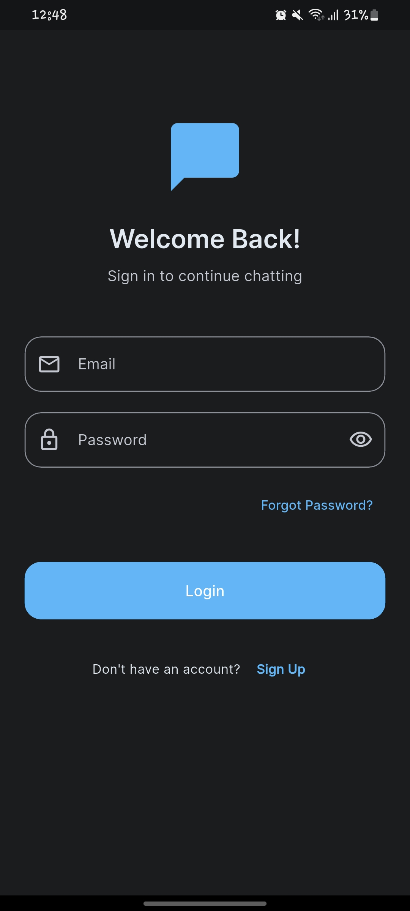
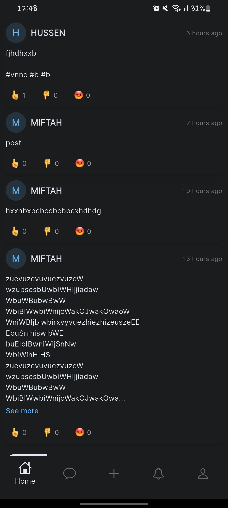
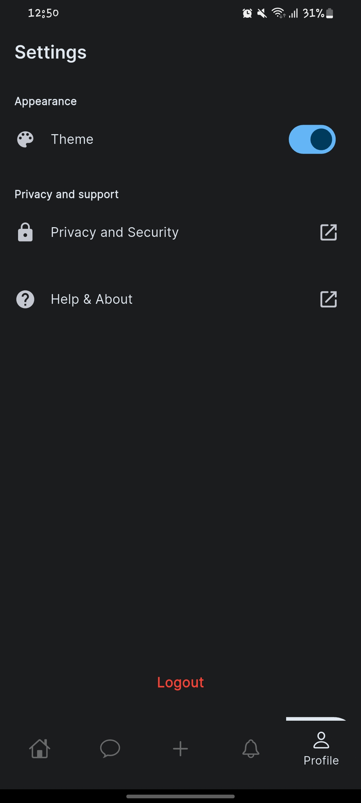
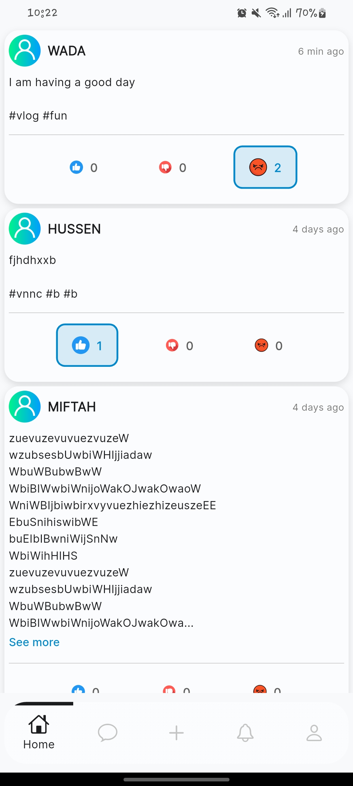
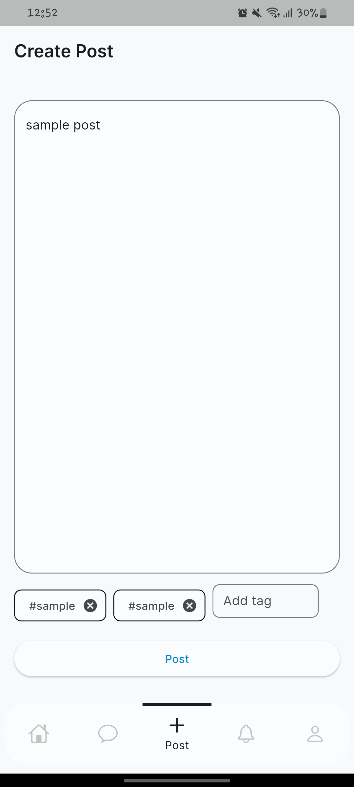

# Chatly

A simple chat app built with Flutter — for real‑time communication across platforms (Android, iOS, Web, Desktop).  

---

## What is Chatly  

Chatly is a social media and chatting application built using Flutter. It aims to let users chat across devices seamlessly, offering a consistent UI and support for multiple platforms out of the box.  

---

## Features  

- Real‑time messaging (text) and text based posts
- integrated with supabase 
- Clean and minimal UI  
- email based authentication
- caching datas for offline browse
- Light/Dark theme support

---

## Screenshots  

|  |  |  |  |
|-----------------------------------------------|-----------------------------------------------|-----------------------------------------------|-----------------------------------------------|
|  |  |  |  |

---

## Getting Started / How to Run  

1. Clone the repo:  
   ```bash
   git clone https://github.com/Miftah‑Fentaw/Chatly.git

2. run the app app:  
   ```bash
   cd Chatly
   flutter pub get
   flutter run